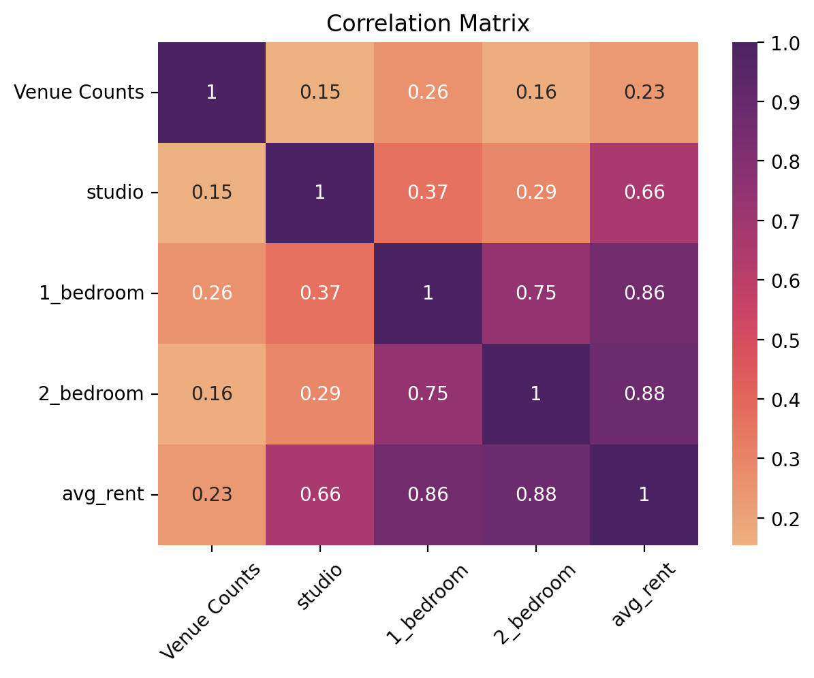

# Clustering NYC Neighborhoods
<p style="text-align: center;"><b> Midterm project - LHL Data Science Bootcamp </b></p>


_Figure credit: [Emiliano Bar](https://unsplash.com/photos/kheTI8pIywU?utm_source=unsplash&utm_medium=referral&utm_content=creditShareLink)_

## Introduction
In this project, we aimed to segment neighborhoods in New York City (NYC) into different clusters based on the availability of healthcare services. 

Different clustering models from the Scikit-Learn package were used, such as the K-means algorithm, hierarchichal clustering and DBScans. Venue information was obtained using the Foursquare API. Geolocation and populational information was obtained from the [NYC Open Data](https://data.cityofnewyork.us/) database.

The ```src``` folder contains the code used during the data processing, modelling and figure generation steps. Raw and processed .csv files can be found in the ```data``` folder. Finally, the resulting submission.csv file containing neighborhoods and respective cluster labels can be found in the ```output``` folder, as well as figures generated during the data exploration and visualization steps.  

## Data Acquisition
Geolocation on each NYC neighborhood was obtained from a [Neighborhood Names GIS file](https://drive.google.com/file/d/16hGHxuPHDVVwlHhiZ5pFoNMfmGjh_JYb/view?usp=sharing). After acquiring the coordinates for each neighborhood, GET requests were sent to the Foursquare API to get venue information within a 500 m radius for each neighborhood. Focus was given to health and medicine-related locations, but data for arts & entertainment and government/public facilities is also available in the ```data``` folder. 

Economic information relates to the [average](https://drive.google.com/file/d/17kDaedI8cBoZz8rKY7yZ0N-QNSLChQWR/view?usp=sharing) and [median](https://drive.google.com/file/d/1EyXSpnV--2iYmYzlGZmMgonbW9jzJdcv/view?usp=sharing) house pricing for different neighborhoods in NYC in different years. Some of the median prices had to be estimated since there was missing information for 1-Bedroom and Studio apartments. The rent price data was merged with the other datasets by using neighborhood as a merging point. 

Populational data is from two census that took place on different years (2000 and 2010). The data includes borough and neighborhood information. Since the neighborhoods are grouped for tabulation purposes, only the borough was used to connect populational data with healtcare service information. 

## Findings Summary

Different features were used for clustering the neighborhoods. The most interesting method to group neighborhoods that have similarities in their top 5 most common healthcare facility types. The resulting clustering can be seen in a map (snippet shown below). To visualize the clusters in an intercative map, please download the [HTML file](/output/Most_Common_Category_Clusters.HTML) and open it with preferred browser.

[](/output/Most_Common_Category_Clusters.HTML).

The relationship between rent price and access to healthcare was evaluated with the help of a correlation matrix. To do that, the median rent price data was used since it included more neighborhoods. The data from the median price data was used to calculate the average rent price by neighborhood. 
